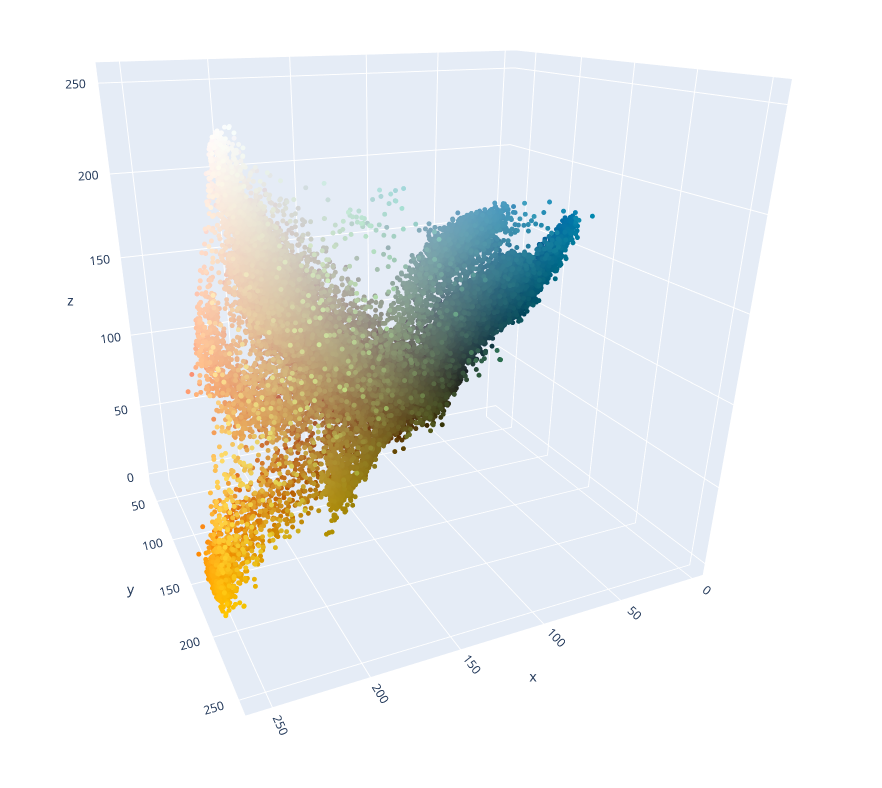

# K-Means Color Palette Visualization
### Color palette generation using K-means clustering; further 3D RGB space visualization. 

## How it works

1. Reads image into numpy array using OpenCV2
2. Resizes image to 420px short edge to make computation faster
3. Reshapes array to get one dimensional series of pixel RGB values
4. Fits K-Means clustering model to pixel series
5. Visualisation with plot.ly

## Examples:

#### Image to generate color palette for

#### Visualization of image's pixels in 3D RGB space

#### Generated colors from K-Means model

#### Visualization of generated colors in 3D RGB space

